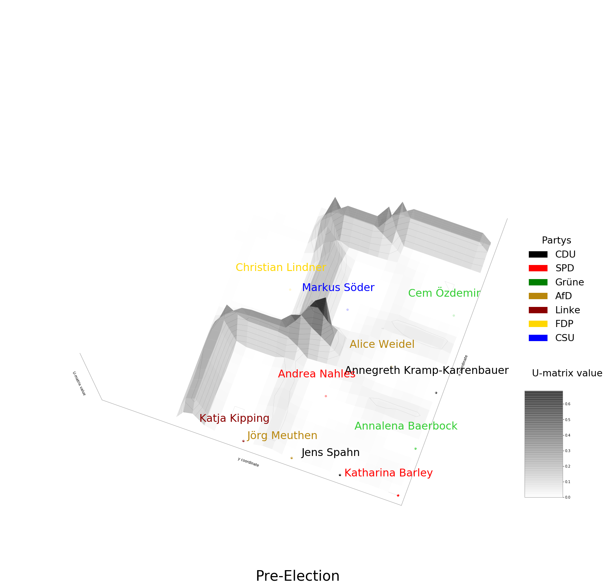

# 
Measuring similarity of German politician's tweets with self-organizing maps

# Results

* The top German politicians don't have a party-specific style when they're campaigning for elections
* After the election some winning parties (CDU \& AfD) exhibit similar tweet styles. They align in a cluster together.
* The members of the SPD strongly change their tweeting style after their bad election result. They decluster with other parties.

# Algorithm
The algorithm described by Kohonen (1990) works as follows:

0. Define a two- or three-dimensional of neurons i and assign every neuron a coordinate in the feature space (also called weight vector). We can assign the weight vector randomly in the cube spanned by the min and max value of all features. Alternatively, we can span the grid in the space spanned by the largest two eigenvectors (principal components).

1. Choose one data point at a time -- either systematically or randomly. If the number of observations is really small, we can use bootstrapping to make sure we reach the necessary number of iterations

2. Compute the Euclidean distances from the data point to each neuron.

3. Identify the neuron with the smallest distance to the data point. This is the best matching unit (BMU).

4. Update the coordinates of the BMU and the neurons using a neighborhood function (f.e. gaussian, bubble, etc.)
The learning rate in the neighborhood function determines how much the position of neurons change iteration and decreases with time. 

5. Start again with 1. until you reached the desired amount of iterations. 

# Tuning Parameters of the model

An SOM possesses 7 tuning parameters:

1. Number of neurons: The larger the better. Our choice is 30x30 neurons. Alternatively use a growing SOM (GSOM).

2. Dimension of grid: No clear rule. If a lot is known about the data distribution, the dimension can be adjusted to follow the distribution more closely. This speeds up the training process.

3. Grid shape: Hexagonal or rectangular. If the data distribution is known, also a more specific shape is possible (circle, ring etc.).

4. Initial position of grid in space: span subspace by the first to d-th principal components (= eigenvectors corresponding to the d largest eigenvalues), initialize weights randomly or by sample points. The initializiation with principal components is supposed to speed up computation

5. Neighborhood function: Typically a Gaussian common choice, radial, triangle, bubble, etc. The most simple choice is a function that only updates the n closest neurons of the BMU

6. Learning rate: Typically decreases with time (lineary, logarithmic, etc.) 

7. Distance measure: The most common distance measure is the Euclidean distance. However, also other measures could be used (Jaccard, Manhattan, etc.)

# Robustness to Change in Parameters

Alternative calibration with bubble neighborhood function and learning rate = 0.25

 

Cluster formation becomes more quadratic but our results from before still hold.

# Useful Resources
* on model parameters: 
* Minisom package for python with a range of tuning parameter options and examples https://github.com/JustGlowing/minisom
